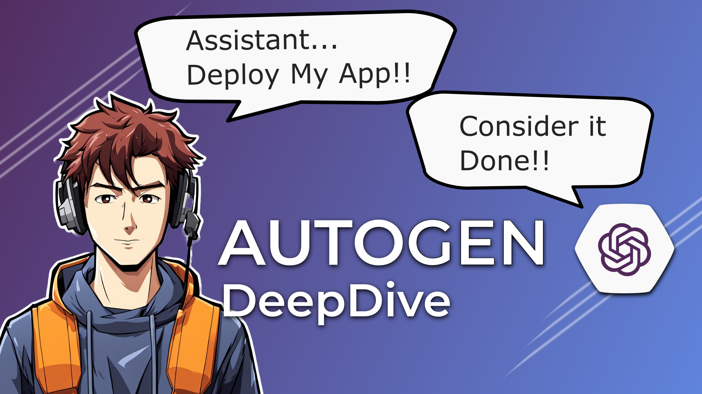

# Querying Kubernetes using AutoGen

> Here's a link to the YouTube video explaining this setup in greater detail:

[]()

## Prerequisites

You need to have the following tools installed:

- [Poetry](https://python-poetry.org/docs/)
- [Docker Desktop](https://www.docker.com/products/docker-desktop/) Or [Racher Desktop](https://rancherdesktop.io/)
- [K3d](https://k3d.io/v5.6.0/)

## Resources

- Jupyter Notebook: [Generate Dataset](./notebooks/Generate%20Dataset.ipynb)
- Jupyter Notebook: [Prediction With FB Propher](./notebooks/Prediction%20with%20Prophet.ipynb)
- [Sample K8s Deployment](./k8s/deployment.yaml)
- [Keda Postgres Scaler](./k8s/keda-scaledobject.yaml)

## Environment Setup

### 1. Create New Conda & K8s Environment

```bash
# To setup conda
conda env create -f environment.yaml

# To setup a k3d cluster
k3d cluster create --config k3d.config.yaml
```

### 2. Install the LLM Inference Server

Use this [guide](https://github.com/YourTechBud/llm-inference-server) to setup the inference server locally.

### 3. Run the AutoGen App

```bash
poetry run python src/main.py --prompt "give me all the pods"
```
