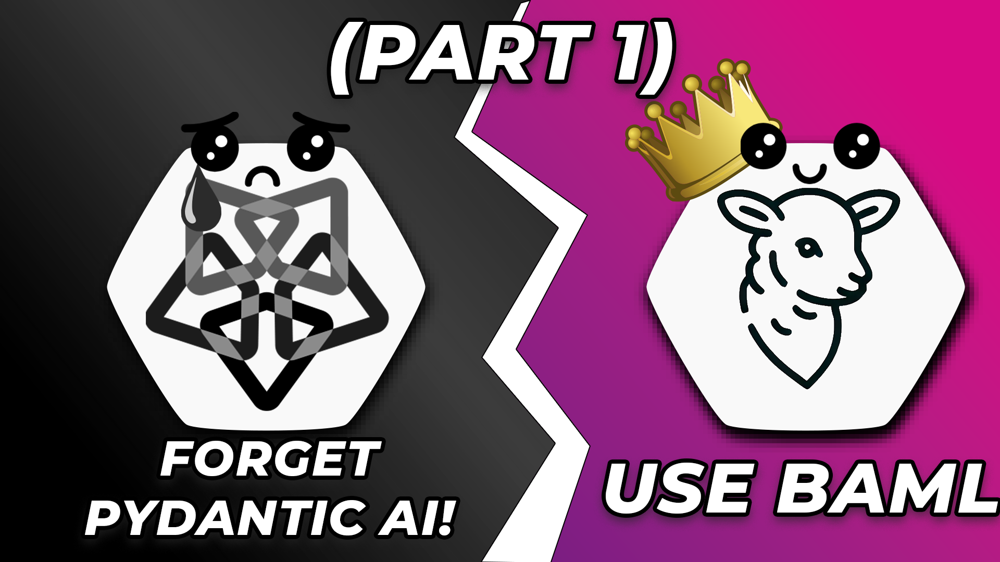

# Building Agents with BAML

> Consider giving this repo a ✨! Thanks!!!

This project introduces a new agentic framework - **Not Overengineered and Probably Erroneous Agents** OR **NOPE Agents**.

Here's a link to the YouTube video explaining this setup in greater detail:

[](https://youtu.be/Li4C1c0szmc)

## Prerequisites

You need to have the following tools installed:

- [pnpm](https://pnpm.io/)
- [Inferix](https://github.com/YourTechBud/inferix) or any OpenAI compatible API.

## Environment Setup

### 1. Setup pnpm

```bash
# Setup dependencies
pnpm install

# Generate BAML client
pnpm run generate

# Build the project
pnpm run build

# Start the TypeScript compiler
pnpm run watch
```

### 2. Install Inferix (OpenAI compatible API)

> Note: You can use any OpenAI compatible backend or simply use OpenAI itself.

- Feel free to use any OpenAI compatible API.
- Make sure you have [Ollama](https://ollama.ai/) installed.
- Make sure you have pulled a model. I recommend [Qwen 2.5 32B](https://ollama.com/library/qwen2.5:32b).
- Use this [guide to setup inferix](https://github.com/YourTechBud/inferix) to host a OpenAI compatible API capable of function calling.

### 3. Set the environment variables

- Checkout the example dotenv file at `.env.example`.
- Create a new `.env` using the example one as a template.
- Replace the variables as necessary.

## Run the app

We've got a few scripts in this project:

1. `pnpm run 01a` - A simple agent
2. `pnpm run 01b` - A simple agent with chat history
3. `pnpm run 02a` - A simple structured response example with BAML
4. `pnpm run 02b` - A complete structured response example with BAML
5. `pnpm run 02c` - A complete structured response example with NOPE Agents
6. `pnpm run 03a` - A simple tool calling example with BAML
7. `pnpm run 03b` - A complete tool calling example with BAML
8. `pnpm run 03c` - A complete tool calling example with NOPE Agents
