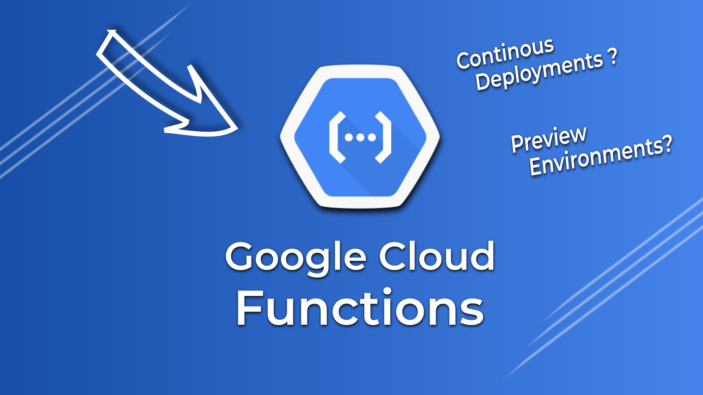

# Google Cloud Functions Introduction

> Here's a link to the YouTube video explaining this setup in greater detail: 

[](https://youtu.be/I0vJDmw6P4c)

## Prerequisites
 
- You'll need to have [gcloud](https://cloud.google.com/sdk/docs/installhttps://docs.docker.com/engine/install/) installed.
- Make sure `gcloud` is configured. You can configure `gcloud` by running `gcloud init`.

## Steps To Reproduce The Video

### 1] Deploy Your Code On Google Cloud Functions

```bash
gcloud functions deploy greeter --trigger-http --gen2 --runtime go116 --region us-east1 --entry-point=GreeterGet
```

> Answer `yes` for all the prompts.

You can test the app by running:

```bash
curl https://[APP_URL]
```

### 2] Implement Continous Deployments With Github Actions

1. Create a Service Account on GCP with `Admin` privileges and generate a `credential.json` file.
2. Create a secret in your GitHub Repository with the name `GCP_CREDS` and paste the contents in the `credentials.json` file as the value.
3. Push the contents of this directory including the `.github` folder to your git repo.
4. Let the magic begin

### 3] Implement Preview Environments

Simply create a PR on the main branch and wait for the comment to appear.
