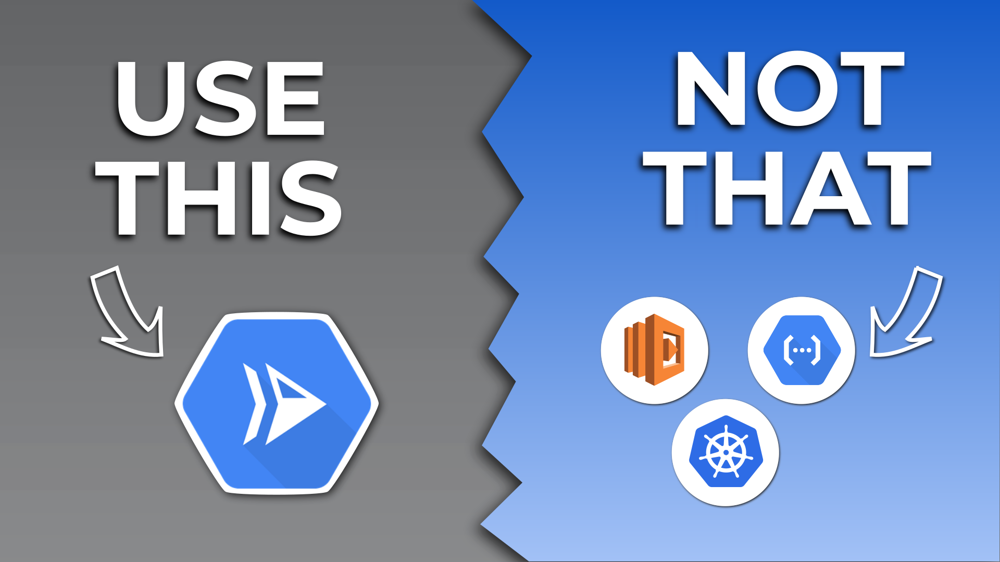

# Google Cloud Run Introduction

> Here's a link to the YouTube video explaining this setup in greater detail: 

[](https://youtu.be/bKBBbryKj1w)

## Prerequisites
 
- You'll need to have [gcloud](https://cloud.google.com/sdk/docs/installhttps://docs.docker.com/engine/install/) installed.
- Make sure `gcloud` is configured. You can configure `gcloud` by running `gcloud init`.

## 1] Deploy Your App On Google Cloud Run

```bash
gcloud run deploy greeter
```

> Answer `yes` for all the prompts.

You can test the app by running:

```bash
curl https://[APP_URL]/greeting/YourTechBud
```

## 2] Deploy Your App On Google Cloud Run [The Declarative Way]

First retreive the config of the deployed app by using:

```bash
gcloud run services describe greeter --format export > service.yaml
```

Make any changes in `main.go` (like changing the default greeting) then build the application using [Google Cloud Build](https://cloud.google.com/build).

```bash
gcloud builds submit --tag us-east1-docker.pkg.dev/space-cloud/cloud-run-source-deploy/greeter:0.2.0
```

In `service.yaml`, update the `spec.template.spec.containers[0].image` to match the newly deployed image. Also, update the revision name mentioned in `spec.template.metadata.name`.

You can test the new version of the app by running:

```bash
curl https://[APP_URL]/greeting/YourTechBud
```

## 3] Split Traffic Between Revisions

In `service.yaml` update the `spec.traffic` section to split traffic between the previous and the latest revisions.

```yaml
  traffic:
  - revisionName: [PREVIOUS_REVISION_NAME]
    percent: 50
  - latestRevision: true
    percent: 50
```