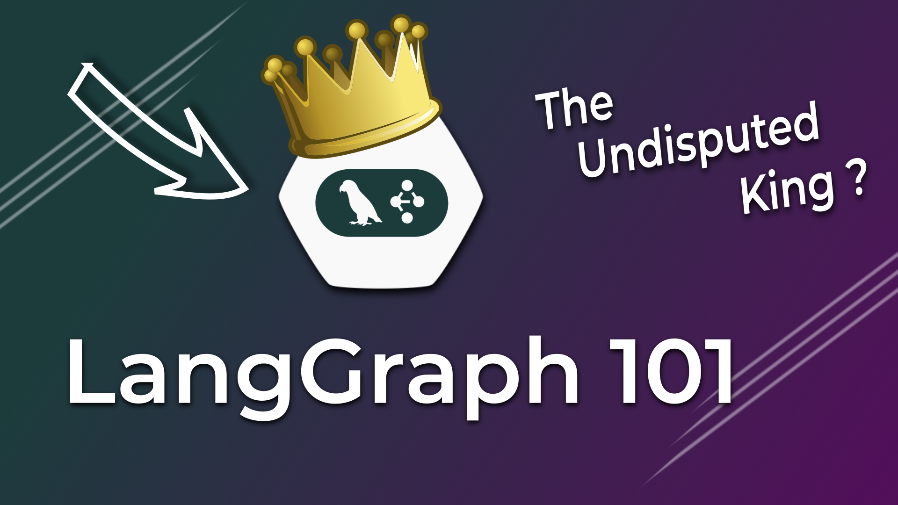

# Langgraph 101

> Consider giving this repo a ✨! Thanks!!!

Here's a link to the YouTube video explaining this setup in greater detail: 

[](https://youtu.be/fvYWMq9tLdQ)

## Prerequisites

You need to have the following tools installed:

- [Poetry](https://python-poetry.org/docs/)
- [Inferix](https://github.com/YourTechBud/inferix) or any OpenAI compatible API.

## Environment Setup

### 1. Setup Poetry

```bash
# To setup poetry
poetry install
```

### 2. Install Inferix (OpenAI compatible API)

> Note: You can use any OpenAI compatible backend or simply use OpenAI itself.

- Feel free to use any OpenAI compatible API.
- Make sure you have [Ollama](https://ollama.ai/) installed.
- Make sure you have pulled a model. I recommend [Qwen 2.5 32B](https://ollama.com/library/qwen2.5:32b).
- Use this [guide to setup inferix](https://github.com/YourTechBud/inferix) to host a OpenAI compatible API capable of function calling.

### 3. Set the environment variables

Make sure these environment variables are set. They are used in `./k8s_bot/helpers.py`.

- `OPENAI_API_KEY`
- `OPENAI_BASE_URL`

> You'll probably have to change the models being used everywhere as well

## Run the app

We've got a few scripts in this project:

1. `poetry run basic-bot` - A basic bot that uses a single LLM to respond to user requests.
2. `poetry run basic-tools` - A bot that uses tools to respond to user requests.
3. `poetry run expert` - A bot that uses a chain of LLMs to respond to user requests.
4. `poetry run k8s` - A self-correcting bot that uses a chain of LLMs to respond to user requests.
5. `poetry run input` - A bot that verifies user input and then responds to user requests.
6. `poetry run main` - The final script that runs the entire workflow.
