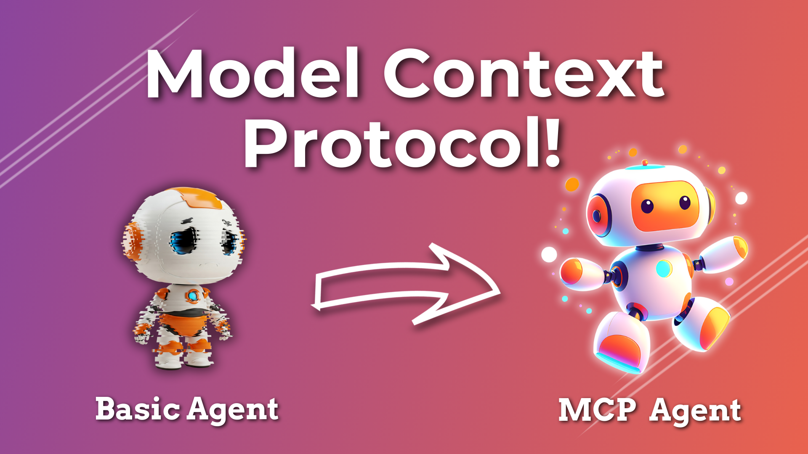

# Pydantic Graph 101

> Consider giving this repo a ✨! Thanks!!!

Here's a link to the YouTube video explaining this setup in greater detail:

[](https://youtu.be/9izHUWherYw)

## Prerequisites

You need to have the following tools installed:

- [uv](https://docs.astral.sh/uv/)
- [Inferix](https://github.com/YourTechBud/inferix) or any OpenAI compatible API.

## Environment Setup

### 1. Setup uv

```bash
# To setup uv
uv sync
```

### 2. Install Inferix (OpenAI compatible API)

> Note: You can use any OpenAI compatible backend or simply use OpenAI itself.

- Feel free to use any OpenAI compatible API.
- Make sure you have [Ollama](https://ollama.ai/) installed.
- Make sure you have pulled a model. I recommend [Qwen 2.5 32B](https://ollama.com/library/qwen2.5:32b).
- Use this [guide to setup inferix](https://github.com/YourTechBud/inferix) to host a OpenAI compatible API capable of function calling.

### 3. Set the environment variables

- Checkout the example dotenv file at `.env.example`.
- Create a new `.env` using the example one as a template.
- Replace the variables as necessary.

## 4. Start the MCP servers

1. Task manager - `uv run server/server_tasks.py`
2. Calendar manager - `uv run server/server_calendar.py`

## 5. Run the app

We've got a few scripts in this project. Check them out in the `client` directory.

```bash
# You can run a script using this command
uv run client/01a_simple_client.py
```
