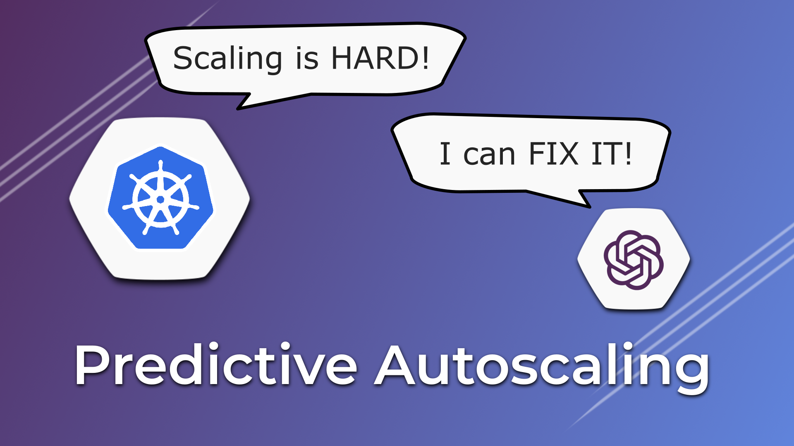

# Predictive Autoscaling Applications Using Keda & Facebook Prophet

> Here's a link to the YouTube video explaining this setup in greater detail: 

[](https://youtu.be/MhlkAivKkCw)

## Prerequisites

You need to have the following tools installed:

- [Kubectl](https://kubernetes.io/docs/tasks/tools/)
- [Helm](https://helm.sh/docs/intro/install/)
- [PSQL](https://www.timescale.com/blog/how-to-install-psql-on-mac-ubuntu-debian-windows/)

## Resources

- Jupyter Notebook: [Generate Dataset](./notebooks/Generate%20Dataset.ipynb)
- Jupyter Notebook: [Prediction With FB Propher](./notebooks/Prediction%20with%20Prophet.ipynb)
- [Sample K8s Deployment](./k8s/deployment.yaml)
- [Keda Postgres Scaler](./k8s/keda-scaledobject.yaml)

## Environment Setup

### 0. Create New Conda & K8s Environment

```bash
# To setup conda
conda env create -f environment.yaml

# To setup a k3d cluster
k3d cluster create --config k3d.config.yaml
```

### 1. Install Keda

```bash
# 1. Add the Keda Helm Repo
helm repo add kedacore https://kedacore.github.io/charts
helm repo update

# 2. Install Keda
helm install keda kedacore/keda --create-namespace --namespace keda --wait
```

### 2. Install Postgres

```bash
# 1. Add the Bitnami Helm Repo
helm repo add bitnami https://charts.bitnami.com/bitnami
helm repo update

# 2. Install Postgres
helm install postgresql-dev bitnami/postgresql --wait

# 3. Store Postgres Credentials
export POSTGRES_PASSWORD=$(kubectl get secret --namespace default postgresql-dev -o jsonpath="{.data.postgres-password}" | base64 -d)
```

### 3. Install Sample Application

```bash
kubectl apply -f k8s/deployment.yaml
```

## Timeseries Forcasting

### 1. Generate Sample Dataset (Optional) 

```bash
jupyter nbconvert --to notebook --inplace --execute notebooks/Generate\ Dataset.ipynb
```

### 2. Forecast Timeseries 

```bash
jupyter nbconvert --to notebook --inplace --execute notebooks/Prediction\ with\ Prophet.ipynb
```

### 3. Deploy The Model To Postgres

```bash
# 1. Connect to Postgres running in Kubernetes
kubectl port-forward --namespace default svc/postgresql-dev 5432:5432 &
PGPASSWORD="$POSTGRES_PASSWORD" psql --host 127.0.0.1 -U postgres -d postgres -p 5432
```

```sql
-- Create Table and copy forecast data to it
CREATE TABLE timeseries_forecast (
  timestamp TIMESTAMP PRIMARY KEY,
  value DECIMAL
);
\copy timeseries_forecast FROM './notebooks/prediction.csv' WITH (FORMAT csv, HEADER true);
```

```sql
-- Check if Data is Loaded Properly
SELECT MAX(value)
FROM (
  SELECT value
  FROM timeseries_forecast
  WHERE timestamp > CURRENT_TIMESTAMP
  ORDER BY timestamp
  LIMIT 3
) t;
```

## Apply Model To Application

### 1. Deploy Keda Scaled Object For Application
```bash
kubectl apply -f k8s/keda-scaledobject.yaml
```

### 2. Watch Your Application Scale

```bash
watch kubectl get pods -n default -l app=greeter
```