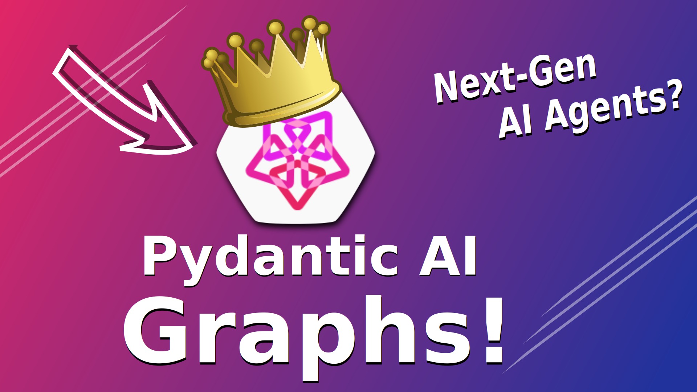

# Pydantic Graph 101

> Consider giving this repo a ✨! Thanks!!!

Here's a link to the YouTube video explaining this setup in greater detail:

[](https://youtu.be/ePp7Gq2bJjE)

## Prerequisites

You need to have the following tools installed:

- [uv](https://docs.astral.sh/uv/)
- [Inferix](https://github.com/YourTechBud/inferix) or any OpenAI compatible API.

## Environment Setup

### 1. Setup uv

```bash
# To setup uv
uv sync
```

### 2. Install Inferix (OpenAI compatible API)

> Note: You can use any OpenAI compatible backend or simply use OpenAI itself.

- Feel free to use any OpenAI compatible API.
- Make sure you have [Ollama](https://ollama.ai/) installed.
- Make sure you have pulled a model. I recommend [Qwen 2.5 32B](https://ollama.com/library/qwen2.5:32b).
- Use this [guide to setup inferix](https://github.com/YourTechBud/inferix) to host a OpenAI compatible API capable of function calling.

### 3. Set the environment variables

- Checkout the example dotenv file at `.env.example`.
- Create a new `.env` using the example one as a template.
- Replace the variables as necessary.

## Run the app

We've got a few scripts in this project:

1. `uv run src/00_humble_call.py` - Making a simple LLM call using the `pydantic-ai` sdk.
2. `uv run src/01_first_graph.py` - A basic graph with a single node using `pydantic-graph`.
3. `uv run src/02a_passing_data-nodes.py` - Passing data between nodes of the graphs via simple constructor arguments.
4. `uv run src/02b_passing_data-state.py` - Passing data between nodes of the graphs via `GraphState`.
5. `uv run src/02c_passing_data-deps.py` - Passing data between nodes of the graphs via `GraphDeps`.
6. `uv run src/03_flow_control.py` - Flow control using `pydantic-graph`.
7. `uv run src/04_real_deal.py` - A complete agentic workflow made using `pydantic-graph`.
