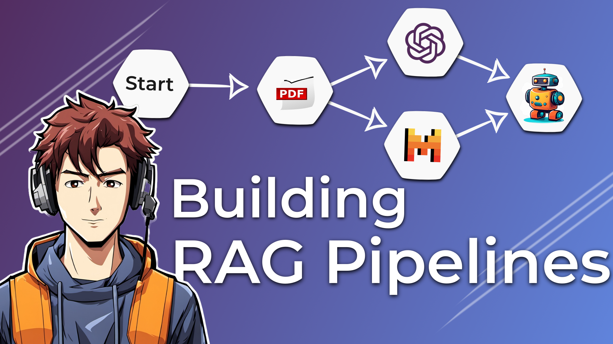

# Building Your First RAG Pipeline

> Consider giving this repo a ✨! Thanks!!!

Here's a link to the YouTube video explaining this setup in greater detail: 

[](https://youtu.be/Fm2ZzS5CTP8)

## Prerequisites

You need to have the following tools installed:

- [Poetry](https://python-poetry.org/docs/)
- [Inferix](https://github.com/YourTechBud/inferix) or any OpenAI compatible API.

## Environment Setup

### 1. Setup poetry

```bash
# To setup poetry
poetry install
```

### 2. Install Inferix (OpenAI compatible API)

> Note: You can use any OpenAI compatible backend or simply use OpenAI itself.

- Feel free to use any OpenAI compatible API.
- Make sure you have [Ollama](https://ollama.ai/) installed.
- Make sure you have pulled a model. I recommend [Qwen 2.5 32B](https://ollama.com/library/qwen2.5:32b).
- Use this [guide to setup inferix](https://github.com/YourTechBud/inferix) to host a OpenAI compatible API capable of function calling.

### 3. Set the environment variables

- `OPENAI_API_KEY`
- `OPENAI_API_BASE_URL`

> You'll probably have to change the models being used everywhere as well

## Run the app

We've got a few scripts in this project:

1. `poetry run 01` - Making a simple LLM call using the `openai` sdk.
2. `poetry run 02` - Demonstration of how in-context learning can really personalize AI responses.
3. `poetry run 03` - Demonstration of how vector/similarity search works.
4. `poetry run 04` - This script will fail. The chunks generated are too large for embedding to work.
5. `poetry run 05` - A basic RAG pipeline with recursive text splitting.
6. `poetry run 06` - A slightly better RAG pipeline using Markdown based splitting.
